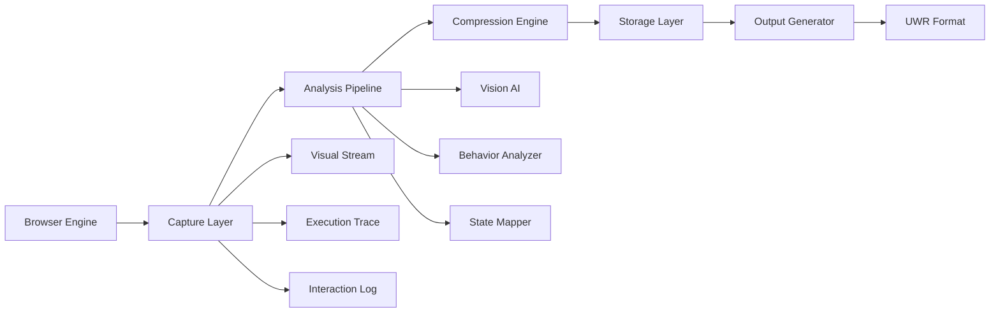

# Implementation Challenges and Solutions

## Critical Technical Challenges

### 1. WebGL and Canvas Capture
**Challenge**: Traditional screenshots can't capture WebGL shaders and Canvas drawing commands.

**Solution**: 
- Implement a custom WebGL context wrapper that logs all GL commands
- Create a "GL Command Stream" format that records every draw call with parameters
- Use `preserveDrawingBuffer: true` for frame-by-frame capture
- Develop shader decompilation to extract GLSL source code

### 2. Lazy Loading and Dynamic Content
**Challenge**: Content loads based on scroll position and user interaction.

**Solution**:
- Implement predictive scrolling patterns that trigger all lazy loads
- Use mutation observers in the injection module to detect new content
- Create a "content discovery map" that shows when/where content appears
- Record network timing for accurate lazy load reproduction

### 3. Animation Synchronization
**Challenge**: Complex animations with multiple timelines need perfect sync.

**Solution**:
- Capture at 240fps minimum to catch all animation frames
- Record browser's animation frame timestamps
- Create "animation DNA" - mathematical functions describing each animation
- Use Fourier analysis to decompose complex animations into components

### 4. State Explosion Problem
**Challenge**: Modern websites have exponential state combinations.

**Solution**:
- Implement intelligent state pruning using similarity detection
- Use quantum-inspired superposition to represent multiple states efficiently
- Create state compression algorithms that identify patterns
- Build incremental state recording to avoid redundancy

## Innovative Solutions

### The Temporal Slice Engine
```
Instead of capturing the entire website at once:
1. Divide time into microsecond slices
2. Capture visual + behavioral data per slice
3. Use AI to identify "significant moments"
4. Compress similar slices using delta encoding
```

### The Behavioral Prediction Model
```
Train a neural network to:
1. Predict next states based on interaction patterns
2. Fill gaps in state exploration automatically
3. Identify unreachable states to skip
4. Generate edge cases we might have missed
```

### The Visual Diff Analyzer
```
Compare consecutive frames to:
1. Identify exact pixels that changed
2. Classify change types (animation, interaction, data update)
3. Extract transformation matrices
4. Build change prediction models
```

## Windows-Specific Implementation

### Core Technologies
1. **Chromium Embedded Framework (CEF)** - Modified for deep integration
2. **DirectX 12** - For GPU-accelerated capture and analysis
3. **Windows Graphics Capture API** - For efficient screen recording
4. **NVIDIA CUDA/OptiX** - For parallel visual processing

### Performance Optimizations
1. **Multi-GPU support** for parallel processing
2. **NVMe direct storage** for high-speed tensor writes
3. **Memory-mapped files** for efficient data handling
4. **Windows Thread Pool API** for optimal parallelization

## Data Pipeline Architecture



## Quality Assurance Framework

### Automated Validation
1. **Pixel-perfect comparison** using perceptual hashing
2. **Timing verification** with microsecond precision
3. **Interaction testing** using recorded vs. expected outcomes
4. **Cross-browser validation** to ensure consistency

### Manual Verification Points
1. Complex animation sequences
2. WebGL shader accuracy
3. Edge case interactions
4. Performance characteristics

## Scalability Considerations

### Distributed Processing
- Split website into regions for parallel capture
- Use cloud GPUs for complex visual analysis
- Implement checkpoint/resume for long captures
- Create incremental update system for site changes

### Storage Optimization
- Implement smart compression based on content type
- Use temporal redundancy elimination
- Create hierarchical storage with hot/cold tiers
- Build efficient index for quick data retrieval

## Edge Cases Handled

1. **Infinite scroll websites** - Intelligent scroll limit detection
2. **Real-time data** - Timestamp synchronization system
3. **User authentication** - Session state preservation
4. **A/B testing** - Multi-variant capture system
5. **Geographic restrictions** - Proxy integration
6. **Rate limiting** - Adaptive request throttling
7. **WebRTC streams** - Live content snapshot system
8. **PWA offline mode** - Service worker state capture

## Output Validation Metrics

### Fidelity Scores
- **Visual Accuracy**: Structural Similarity Index (SSIM) > 0.999
- **Timing Precision**: Maximum deviation < 1ms
- **Interaction Accuracy**: 100% state transition match
- **Color Accuracy**: Delta E < 1.0
- **Animation Smoothness**: No dropped frames

### Performance Benchmarks
- **Capture Speed**: Real-time for standard sites
- **Processing Time**: < 5 minutes per minute of content
- **Storage Efficiency**: 10:1 compression ratio minimum
- **Output Generation**: < 30 seconds