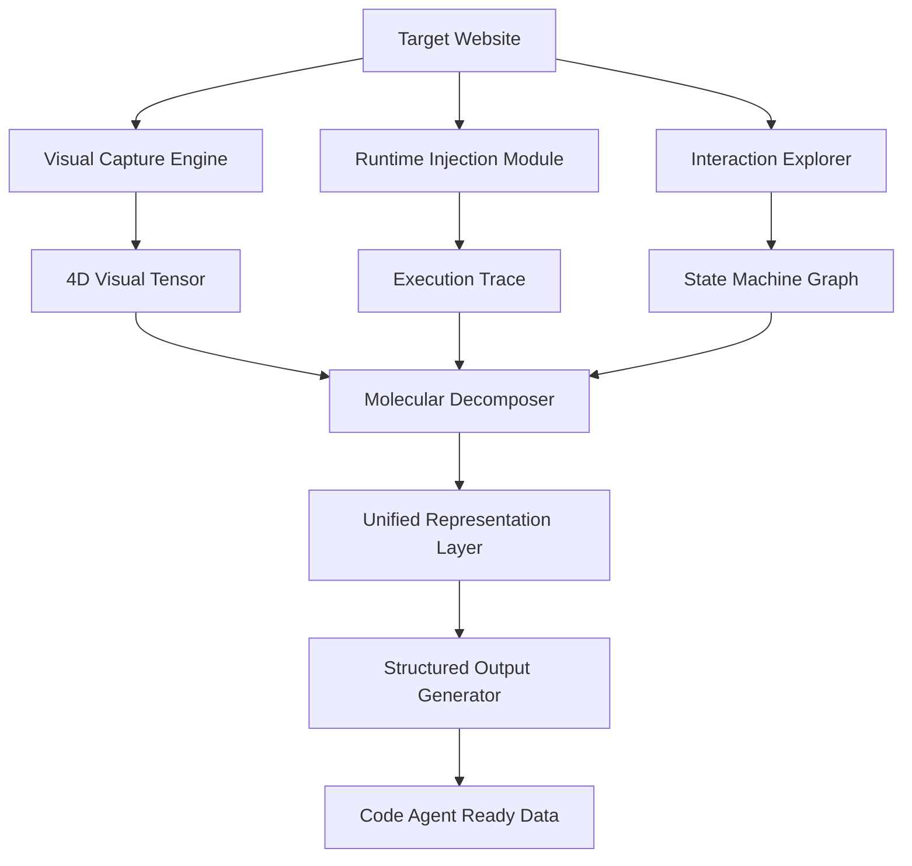

# Unified Pipeline Architecture for Revolutionary Website Cloning

## Core Architecture: The Hybrid Approach

After analyzing the six innovative strategies, I propose a **Multi-Modal Fusion Pipeline** that combines the strengths of each approach:

### Primary Pipeline Components



## Detailed Component Design

### 1. Visual Capture Engine
- **High-resolution screen recording** at 240fps minimum
- **Automated scrolling** in all directions with sub-pixel precision
- **Multi-viewport capture** (mobile, tablet, desktop simultaneously)
- **Depth buffer extraction** for 3D elements
- Output: 4D tensor [x, y, z, time] with RGB + alpha + depth

### 2. Runtime Injection Module
- **Browser instrumentation** via modified Chromium build
- **WebGL/Canvas command interception**
- **Animation frame timeline recording**
- **Network request sequencing**
- Output: Complete execution trace with timing data

### 3. Interaction Explorer
- **Automated interaction discovery** using reinforcement learning
- **State space exploration** with backtracking
- **Edge case detection** (error states, loading states, empty states)
- Output: Directed graph of all possible states and transitions

### 4. Molecular Decomposer
- **Computer vision segmentation** using transformer models
- **Element classification** into atomic types
- **Relationship mapping** between elements
- **Behavioral pattern extraction**
- Output: Hierarchical element tree with properties and relationships

## Output Data Structure

### The Universal Website Representation (UWR) Format

```json
{
  "version": "1.0",
  "metadata": {
    "captureTimestamp": "2024-01-01T00:00:00Z",
    "fidelityScore": 0.999,
    "targetUrl": "https://example.com",
    "viewportConfigurations": []
  },
  "visualData": {
    "4dTensor": {
      "format": "compressed_binary",
      "dimensions": [1920, 1080, 100, 10000],
      "dataUrl": "visual_tensor.bin"
    },
    "keyframes": []
  },
  "molecules": [
    {
      "id": "mol_001",
      "type": "interactive_button",
      "visualSignature": "base64_encoded_image",
      "bounds": {
        "static": {"x": 100, "y": 200, "w": 150, "h": 50},
        "dynamic": "bounds_timeline.json"
      },
      "properties": {
        "backgroundColor": {
          "default": "#007bff",
          "hover": "#0056b3",
          "active": "#004085"
        },
        "animations": []
      },
      "interactions": {
        "click": {
          "resultingState": "state_002",
          "timing": {"delay": 0, "duration": 300}
        }
      }
    }
  ],
  "stateGraph": {
    "nodes": [],
    "edges": [],
    "initialState": "state_001"
  },
  "executionTrace": {
    "renderingCommands": [],
    "networkSequence": [],
    "computedStyles": []
  },
  "behavioralEquations": [
    {
      "element": "mol_001",
      "property": "opacity",
      "equation": "1 - (scrollY / 1000)",
      "constraints": {"min": 0.3, "max": 1}
    }
  ]
}
```

## Key Innovations in Output Format

### 1. No Assumptions Policy
- Every visual state is explicitly recorded
- All timing information is precise to microseconds
- Every possible interaction path is documented
- No interpolation or guessing required

### 2. Redundant Verification Layers
- Visual data can verify molecular decomposition
- Execution trace can verify behavioral equations
- State graph can verify interaction outcomes

### 3. Platform-Agnostic Representation
- Output is pure data, not tied to any web technology
- Can be compiled to any target (HTML/CSS/JS, native apps, game engines)

## Implementation Considerations

### Performance Requirements
- **Storage**: ~10GB per minute of captured website
- **Processing**: GPU acceleration required for real-time analysis
- **Memory**: 32GB minimum for complex sites

### Accuracy Validation
- **Pixel-perfect comparison** between original and reconstructed
- **Timing verification** within 1ms tolerance
- **Interaction fidelity** testing with automated scripts

### Modular Architecture Benefits
1. Each component can be upgraded independently
2. Parallel processing of different capture modes
3. Graceful degradation if one module fails
4. Extensible for future web technologies

## Data Flow for Code Agent

The code agent receives:
1. **Complete visual reference** for pixel-perfect validation
2. **Molecular structure** for component generation
3. **Behavioral specifications** for interaction implementation
4. **State machine** for application logic
5. **Execution trace** for performance optimization

This ensures the code agent has multiple sources of truth and can cross-validate its output against different representations of the same website.