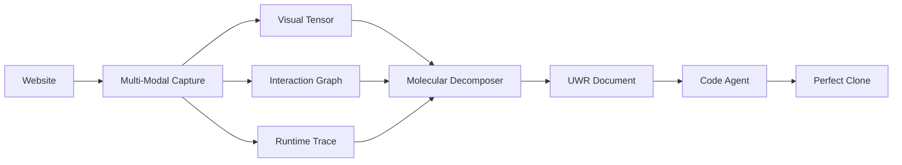

# Universal Website Representation (UWR) Format Specification

## Overview

The Universal Website Representation (UWR) format is a groundbreaking data structure designed for capturing websites with ≥99.9% visual and behavioral fidelity without traditional DOM parsing. It treats websites as multi-dimensional visual and behavioral phenomena, enabling perfect reconstruction by downstream agents.

## Key Features

- **Visual-First Approach**: Captures websites as they appear, not as they're coded
- **Complete Behavioral Mapping**: Records every possible state and interaction
- **Zero Assumptions**: All data is explicit with no interpolation
- **Platform Agnostic**: Can be compiled to any target technology
- **Multi-Modal Validation**: Cross-validates data from multiple sources

## System Requirements

### Development Machine (Confirmed)
- **CPU**: Intel Core i5-14400F (10 cores, 16 threads)
- **RAM**: 32 GB
- **GPU**: NVIDIA RTX 4060 Ti
- **Storage**: 100 GB dedicated
- **OS**: Windows 11 (Linux support planned)

### Performance Capabilities
- **Visual Capture**: 60-120fps standard (240fps capable)
- **GPU Acceleration**: Full CUDA support via RTX 4060 Ti
- **Parallel Processing**: 16 threads for multi-modal capture
- **Storage Throughput**: ~10GB per minute of capture

## Format Components

### 1. Visual Data
- **4D Tensor**: [width, height, depth, time] representation
- **Keyframes**: Significant visual moments
- **Depth Maps**: 3D element information
- **Color Profiles**: Accurate color reproduction

### 2. Molecular Elements
- **Visual Decomposition**: Elements identified through computer vision
- **Type Classification**: 13+ element types supported
- **Relationship Mapping**: Parent/child/sibling connections
- **Lifecycle Tracking**: Creation, modification, destruction

### 3. State Graph
- **Complete State Space**: All possible website states
- **Transition Mapping**: How states connect
- **Trigger Recording**: What causes state changes
- **Animation Tracking**: Frame-by-frame transitions

### 4. Execution Trace
- **Rendering Commands**: GPU/CPU operations
- **Network Sequence**: All network activity
- **Performance Metrics**: FPS, memory, timing
- **Console Output**: Runtime messages

### 5. Behavioral Equations
- **Mathematical Models**: Property changes over time
- **Variable Tracking**: Scroll, time, mouse position
- **Constraint System**: Min/max boundaries
- **Domain Specification**: When equations apply

## File Structure

```
uwr-format-specification/
├── README.md                    # This file
├── uwr-spec-v1.0.md            # Complete specification
├── types/
│   └── uwr-types.ts            # TypeScript type definitions
├── schemas/
│   └── uwr-schema.json         # JSON Schema validation
├── examples/
│   └── simple-button-example.json  # Example UWR document
└── utils/
    └── uwr-loader.ts           # Utility class (pending)
```

## Data Flow



## Validation Metrics

- **Visual Accuracy**: SSIM > 0.999
- **Behavioral Coverage**: 100% state discovery
- **Timing Precision**: < 1ms deviation
- **Color Accuracy**: Delta E < 1.0
- **Cross-Validation**: Multi-source verification

## Usage Example

```typescript
import { UWRDocument } from './types/uwr-types';

// Load a UWR document
const uwr: UWRDocument = JSON.parse(await fs.readFile('capture.uwr'));

// Access visual data
const keyframe = uwr.visualData.keyframes[0];

// Find interactive elements
const buttons = uwr.molecules.filter(m => m.type === 'interactive_button');

// Traverse state graph
const transitions = uwr.stateGraph.edges;

// Evaluate behavioral equations
const opacity = evaluateEquation(uwr.behavioralEquations[0], { scrollY: 500 });
```

## Binary Data Files

The UWR format references external binary files for efficient storage:

- **.uwr-tensor**: 4D visual tensor data
- **.uwr-timeline**: Dynamic property timelines
- **.uwr-depth**: Z-buffer depth information

## Implementation Status

- ✅ Format specification complete
- ✅ TypeScript types defined
- ✅ JSON Schema validation
- ✅ Example document created
- ⏳ Utility loader class (in progress)
- ⏳ Binary format specification (pending)

## Next Steps

1. Complete utility loader implementation
2. Create proof-of-concept visual capture engine
3. Implement automated interaction discovery
4. Build molecular decomposition algorithm

## Contributing

This specification is part of a revolutionary website cloning system. All implementations must maintain ≥99.9% fidelity standards and follow the visual-first, zero-assumption principles.

## License

This specification is proprietary and confidential.